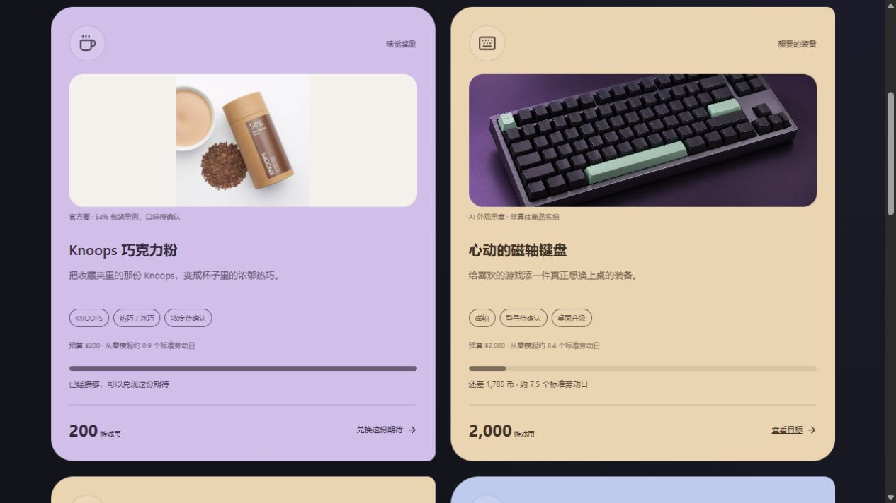

# Reality OS

**v0.1.0-alpha.2 · 开发中 Alpha**

把真实行动变成值得期待的个人奖励。中文界面，Windows 本地 App，无需端口即可打开，断网可用。当前功能和数值仍在迭代，真实任务内容将通过对话确定后配置。

## 当前内容

- 简洁总览、任务日志、分阶段旅程、专注计时与行动统计。
- 行动方向只保留工程开发、学术研究、国际象棋、体能健康、社交连接、生活管理六个大类；旧子类记录自动归入对应大类。赛季功能已移除。
- 一种货币：6 小时有效劳动对应 240 游戏币；任务完成才结算，计时本身不发币。按已记录时长计算，没有记录则按预计时长确认。
- 零头跨任务累计；旧余额和历史结算保留，不重复补发。旧 XP 和虚拟收藏仅保留存档兼容。
- 现实奖励：Knoops、磁轴键盘、ROG 显示器、北京观赛、卡丁车、大餐，以及专属休息日和游戏夜。
- 奖励兑换后进入待享受，享用后留下回忆；未使用可撤销并全额退币。日常休息娱乐自由，不需要兑换。
- 本地存档导入导出，保存失败提示和重试。



消费类按 1 币对应 1 元个人预算定价，休闲类单独定价。游戏不执行支付或预订。商品图片随 App 打包；图片来源、参考型号与生成说明见 [资源说明](docs/reward-media.md)。

## Windows 桌面版

在 [v0.1.0-alpha.2 发布页](https://github.com/KaedeZzz/reality-os/releases/tag/v0.1.0-alpha.2) 下载 `Reality-OS-v0.1.0-alpha.2-windows-x64.zip`，完整解压后双击文件夹中的 `Reality OS.exe`。无需安装 Node.js，也不需要启动服务器。升级前关闭旧版，再解压新版；原有本地存档会继续保留。

### 从源码构建

开发环境需要 Node.js 20.9 或以上版本。

```bash
npm ci
npm run desktop:build
```

构建完成后双击 `release/Reality OS-win32-x64/Reality OS.exe`。保留完整文件夹，运行不需要 Node.js 或开发服务器。打包前请关闭正在运行的 App。更多说明见 [DESKTOP.md](DESKTOP.md)。

存档位于 `%APPDATA%/Reality OS`，独立于程序目录。桌面版固定使用本地存档，不连接 Supabase。源代码仓库不包含用户存档、依赖目录或打包产物。

## 开发与验证

```bash
npm run dev       # 浏览器开发预览，http://localhost:3000
npm test          # 规则、经济及存档测试
npm run typecheck # TypeScript 检查
npm run build     # Web 生产构建
```

首次使用含演示数据。需要时可在系统设置导出备份，或清空进度重新开始。Web 与桌面存档分别保存，可通过导出/导入迁移。

## 结构

- `src/components/`：总览、任务、奖励、专注、统计与设置。
- `src/data/rewards.ts`：个人奖励目录、预算和本地图片说明。
- `src/lib/game.ts`、`economy.ts`、`rewards.ts`：任务结算、币率和兑换规则。
- `src/lib/storage.ts`：存档校验与迁移、本地及可选云存储。
- `desktop/`、`scripts/build-desktop.mjs`：Electron 入口与本地打包。
- `public/rewards/`：离线奖励图片。

版本以 `package.json` 为唯一来源；设置页、锁文件与桌面包同步使用 Alpha 版本。更新记录见 [CHANGELOG.md](CHANGELOG.md)，产品方向见 [PRODUCT-DIRECTION.md](PRODUCT-DIRECTION.md)。

## 可选 Web 云存储

仅 Web 模式支持可选 Supabase。默认不配置，使用浏览器 localStorage（`reality-os-v1`）。如需连接自己的项目：

1. 复制 `.env.example` 为 `.env.local`，填写项目 URL 和 publishable/anon key；不要使用 service_role key。
2. 执行 `supabase/schema.sql`，在 Supabase Authentication 创建账号。
3. 重启开发服务并登录。

当前没有跨设备冲突合并；云端连通性未在个人项目中验证。环境变量文件不提交到仓库。

## Alpha 范围

- 实际任务内容尚未最终配置，默认任务及部分统计为演示内容。
- 磁轴键盘与 ROG 的具体型号、Knoops 可可浓度待确认；产品参考图已明确标注。
- 时间记录属于个人自律工具，没有外部行为验证。
- 当前预发布提供源码及 Windows x64 免安装压缩包；尚无自动更新和 Windows 安装器。
